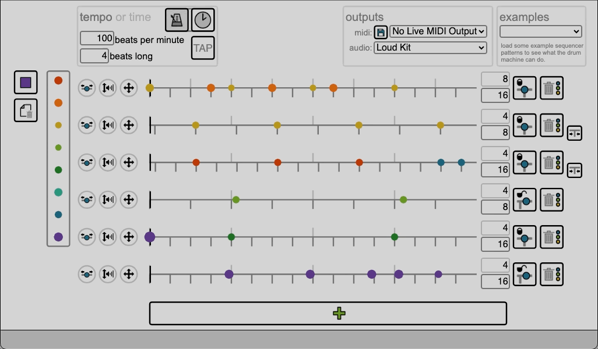

[](https://adamcogen.github.io/drum-machine/#eyJsb29wTGVuZ3RoIjoyNDAwLCJyb3dzIjpbIntcInF1YW50aXplZFwiOnRydWUsXCJzdWJkaXZpc2lvbnNcIjoxNixcInJlZmVyZW5jZUxpbmVzXCI6OCxcInJlZmVyZW5jZUxpbmVzU2hpZnRcIjowLFwic3ViZGl2aXNpb25MaW5lc1NoaWZ0XCI6MCxcIm5vdGVzXCI6W3tcInNhbXBsZVwiOlwiaGktaGF0LW9wZW5cIixcImJlYXRcIjowLFwidm9sdW1lXCI6MC4zMTcxODc1MDAwMDAwMDAxLFwibWlkaU5vdGVcIjo0NCxcIm1pZGlWZWxvY2l0eVwiOjE4fSx7XCJzYW1wbGVcIjpcImhpLWhhdC1jbG9zZWRcIixcImJlYXRcIjozLFwidm9sdW1lXCI6MC43NSxcIm1pZGlOb3RlXCI6NDMsXCJtaWRpVmVsb2NpdHlcIjo0Nn0se1wic2FtcGxlXCI6XCJoaS1oYXQtb3BlblwiLFwiYmVhdFwiOjQsXCJ2b2x1bWVcIjowLjMxNzE4NzUwMDAwMDAwMDEsXCJtaWRpTm90ZVwiOjQ0LFwibWlkaVZlbG9jaXR5XCI6MTh9LHtcInNhbXBsZVwiOlwiaGktaGF0LWNsb3NlZFwiLFwiYmVhdFwiOjYsXCJ2b2x1bWVcIjowLjc1LFwibWlkaU5vdGVcIjo0MyxcIm1pZGlWZWxvY2l0eVwiOjQ2fSx7XCJzYW1wbGVcIjpcImhpLWhhdC1vcGVuXCIsXCJiZWF0XCI6OCxcInZvbHVtZVwiOjAuMzE3MTg3NTAwMDAwMDAwMSxcIm1pZGlOb3RlXCI6NDQsXCJtaWRpVmVsb2NpdHlcIjoxOH0se1wic2FtcGxlXCI6XCJoaS1oYXQtY2xvc2VkXCIsXCJiZWF0XCI6OSxcInZvbHVtZVwiOjAuNzUsXCJtaWRpTm90ZVwiOjQzLFwibWlkaVZlbG9jaXR5XCI6NDZ9LHtcInNhbXBsZVwiOlwiaGktaGF0LW9wZW5cIixcImJlYXRcIjoxMixcInZvbHVtZVwiOjAuMzE3MTg3NTAwMDAwMDAwMSxcIm1pZGlOb3RlXCI6NDQsXCJtaWRpVmVsb2NpdHlcIjoxOH1dfSIsIntcInF1YW50aXplZFwiOnRydWUsXCJzdWJkaXZpc2lvbnNcIjo4LFwicmVmZXJlbmNlTGluZXNcIjo0LFwicmVmZXJlbmNlTGluZXNTaGlmdFwiOjAsXCJzdWJkaXZpc2lvbkxpbmVzU2hpZnRcIjozNy43MTQyODU3MTQyODU3MTUsXCJub3Rlc1wiOlt7XCJzYW1wbGVcIjpcImhpLWhhdC1vcGVuXCIsXCJiZWF0XCI6MSxcInZvbHVtZVwiOjAuNTAwMDAwMDAwMDAwMDAwMSxcIm1pZGlOb3RlXCI6NDQsXCJtaWRpVmVsb2NpdHlcIjozMH0se1wic2FtcGxlXCI6XCJoaS1oYXQtb3BlblwiLFwiYmVhdFwiOjMsXCJ2b2x1bWVcIjowLjUwMDAwMDAwMDAwMDAwMDEsXCJtaWRpTm90ZVwiOjQ0LFwibWlkaVZlbG9jaXR5XCI6MzB9LHtcInNhbXBsZVwiOlwiaGktaGF0LW9wZW5cIixcImJlYXRcIjo1LFwidm9sdW1lXCI6MC41MDAwMDAwMDAwMDAwMDAxLFwibWlkaU5vdGVcIjo0NCxcIm1pZGlWZWxvY2l0eVwiOjMwfSx7XCJzYW1wbGVcIjpcImhpLWhhdC1vcGVuXCIsXCJiZWF0XCI6NyxcInZvbHVtZVwiOjAuNTAwMDAwMDAwMDAwMDAwMSxcIm1pZGlOb3RlXCI6NDQsXCJtaWRpVmVsb2NpdHlcIjozMH1dfSIsIntcInF1YW50aXplZFwiOnRydWUsXCJzdWJkaXZpc2lvbnNcIjoxNixcInJlZmVyZW5jZUxpbmVzXCI6NCxcInJlZmVyZW5jZUxpbmVzU2hpZnRcIjowLFwic3ViZGl2aXNpb25MaW5lc1NoaWZ0XCI6NDEuMTQyODU3MTQyODU3MTQ2LFwibm90ZXNcIjpbe1wic2FtcGxlXCI6XCJ3b29kYmxvY2tcIixcImJlYXRcIjoyLFwidm9sdW1lXCI6MC41LFwibWlkaU5vdGVcIjozOSxcIm1pZGlWZWxvY2l0eVwiOjMwfSx7XCJzYW1wbGVcIjpcIndvb2RibG9ja1wiLFwiYmVhdFwiOjYsXCJ2b2x1bWVcIjowLjUsXCJtaWRpTm90ZVwiOjM5LFwibWlkaVZlbG9jaXR5XCI6MzB9LHtcInNhbXBsZVwiOlwid29vZGJsb2NrXCIsXCJiZWF0XCI6MTAsXCJ2b2x1bWVcIjowLjUsXCJtaWRpTm90ZVwiOjM5LFwibWlkaVZlbG9jaXR5XCI6MzB9LHtcInNhbXBsZVwiOlwidG9tXCIsXCJiZWF0XCI6MTQsXCJ2b2x1bWVcIjowLjUsXCJtaWRpTm90ZVwiOjQyLFwibWlkaVZlbG9jaXR5XCI6MzB9LHtcInNhbXBsZVwiOlwidG9tXCIsXCJiZWF0XCI6MTUsXCJ2b2x1bWVcIjowLjUsXCJtaWRpTm90ZVwiOjQyLFwibWlkaVZlbG9jaXR5XCI6MzB9XX0iLCJ7XCJxdWFudGl6ZWRcIjpmYWxzZSxcInN1YmRpdmlzaW9uc1wiOjgsXCJyZWZlcmVuY2VMaW5lc1wiOjQsXCJyZWZlcmVuY2VMaW5lc1NoaWZ0XCI6MCxcInN1YmRpdmlzaW9uTGluZXNTaGlmdFwiOjAsXCJub3Rlc1wiOlt7XCJzYW1wbGVcIjpcImNsYXBcIixcInByaW9yaXR5XCI6NjM0LjI4NTcxNDI4NTcxNDMsXCJ2b2x1bWVcIjowLjUsXCJtaWRpTm90ZVwiOjM4LFwibWlkaVZlbG9jaXR5XCI6MzB9LHtcInNhbXBsZVwiOlwiY2xhcFwiLFwicHJpb3JpdHlcIjoxODY1LjE0Mjg1NzE0Mjg1NyxcInZvbHVtZVwiOjAuNSxcIm1pZGlOb3RlXCI6MzgsXCJtaWRpVmVsb2NpdHlcIjozMH1dfSIsIntcInF1YW50aXplZFwiOnRydWUsXCJzdWJkaXZpc2lvbnNcIjoxNixcInJlZmVyZW5jZUxpbmVzXCI6NCxcInJlZmVyZW5jZUxpbmVzU2hpZnRcIjowLFwic3ViZGl2aXNpb25MaW5lc1NoaWZ0XCI6MCxcIm5vdGVzXCI6W3tcInNhbXBsZVwiOlwiYmFzcy1kcnVtXCIsXCJiZWF0XCI6MCxcInZvbHVtZVwiOjAuOTYzMTI1MDAwMDAwMDAwNyxcIm1pZGlOb3RlXCI6MzYsXCJtaWRpVmVsb2NpdHlcIjo2MH0se1wic2FtcGxlXCI6XCJzbmFyZVwiLFwiYmVhdFwiOjQsXCJ2b2x1bWVcIjowLjUsXCJtaWRpTm90ZVwiOjM3LFwibWlkaVZlbG9jaXR5XCI6MzB9LHtcInNhbXBsZVwiOlwic25hcmVcIixcImJlYXRcIjoxMixcInZvbHVtZVwiOjAuNSxcIm1pZGlOb3RlXCI6MzcsXCJtaWRpVmVsb2NpdHlcIjozMH1dfSIsIntcInF1YW50aXplZFwiOmZhbHNlLFwic3ViZGl2aXNpb25zXCI6MTYsXCJyZWZlcmVuY2VMaW5lc1wiOjQsXCJyZWZlcmVuY2VMaW5lc1NoaWZ0XCI6MCxcInN1YmRpdmlzaW9uTGluZXNTaGlmdFwiOjAsXCJub3Rlc1wiOlt7XCJzYW1wbGVcIjpcImJhc3MtZHJ1bVwiLFwicHJpb3JpdHlcIjo1ODIuODU3MTQyODU3MTQyOSxcInZvbHVtZVwiOjAuOTYzMTI1MDAwMDAwMDAwNyxcIm1pZGlOb3RlXCI6MzYsXCJtaWRpVmVsb2NpdHlcIjo2MH0se1wic2FtcGxlXCI6XCJiYXNzLWRydW1cIixcInByaW9yaXR5XCI6MTE3OS40Mjg1NzE0Mjg1NzE2LFwidm9sdW1lXCI6MC45NjMxMjUwMDAwMDAwMDA3LFwibWlkaU5vdGVcIjozNixcIm1pZGlWZWxvY2l0eVwiOjYwfSx7XCJzYW1wbGVcIjpcImJhc3MtZHJ1bVwiLFwicHJpb3JpdHlcIjoxNjMyLjAwMDAwMDAwMDAwMDIsXCJ2b2x1bWVcIjowLjk2MzEyNTAwMDAwMDAwMDcsXCJtaWRpTm90ZVwiOjM2LFwibWlkaVZlbG9jaXR5XCI6NjB9LHtcInNhbXBsZVwiOlwiYmFzcy1kcnVtXCIsXCJwcmlvcml0eVwiOjE4MzAuODU3MTQyODU3MTQzLFwidm9sdW1lXCI6MC45NjMxMjUwMDAwMDAwMDA3LFwibWlkaU5vdGVcIjozNixcIm1pZGlWZWxvY2l0eVwiOjYwfSx7XCJzYW1wbGVcIjpcImJhc3MtZHJ1bVwiLFwicHJpb3JpdHlcIjoyMTIyLjI4NTcxNDI4NTcxNCxcInZvbHVtZVwiOjAuNTM3NSxcIm1pZGlOb3RlXCI6MzYsXCJtaWRpVmVsb2NpdHlcIjozMn1dfSJdLCJicG0iOjEwMCwibnVtYmVyT2ZCZWF0cyI6NCwiaXNJbkJwbU1vZGUiOnRydWUsInNhbXBsZUxpc3ROYW1lIjoiTG91ZCBLaXQifQ==)

A drum machine for creating grooves with unique time feels. Try it [here](https://adamcogen.github.io/drum-machine/).

For best results, use Chrome browser on Mac. Mobile not currently supported.

### About

Most drum machines only let you create rhythms that precisely divide each beat or measure into factors of 2 and 3. This drum machine removes that limitation by allowing for any number of divisions, such as prime and large numbers.

Most drum machines only give two options for where beats can be placed: precisely "on time" (on even grid lines starting at the beginning of the measure), or completely freely (with no grid lines at all). This drum machine allows for both of these, but also introduces a third option: it allows you to shift the timing of all grid lines, so that they sound "ahead" or "behind," while remaining evenly spaced.

Combining both of these features allows you to easily create unique drum grooves that are difficult or impossible to emulate in a convential sequencer or DAW.

### Key Features:

- Create complex polyrhythms, odd time signatures, and unusual note divisions by setting any whole number of beats for each note lane
- Create precisely-tuned experimental time feels and swing amounts by shifting each note lane's grid lines forwards or backwards in time as much as you like, so that notes sound ahead of or behind the beat, while remaining evenly spaced.
- Toggle snap-to-grid (quantization) on and off
- Runs in your internet browser
  - Save and share sequencer patterns by copying the site's URL, which updates any time you make a change to the sequencer
  - Use browser 'back' and 'forward' buttons to 'undo' and 'redo' any changes you make

### Other Nice Stuff: 

- Choose from a number of drum kits for live audio output
  - Run locally to add your own drum kits
- Supports live MIDI output to any DAW or MIDI device, as well as exporting sequencer patterns to MIDI files
  - Run locally to change MIDI note pitches by modifying source code
- Specify tempo as BPM (beats per minute), or as a loop length in milliseconds
  - BPM input mode supports 'tap tempo' functionality
  - Millisecond loop length is useful for making rhythmic transcriptions from an existing sound file
- Adjust the volume of each note. The louder the note, the larger its circle will be on-screen.
- Listen to example patterns by loading them from the 'examples' dropdown.
- All interactive GUI elements include help text, which appears when you mouse over them, in the bar at the bottom of the screen

## How To Run Locally

Local HTTP server is needed to avoid Cross Origin Request issues when loading drum samples (at least in Chrome browser).

For Mac, run one of the .sh files included in this repo to start the HTTP server:

Python 2:
```
sh server.python2.sh
```

Python 3:
```
sh server.python3.sh
```

then in a browser go to:

```
http://localhost:8000/
```

and replace 8000 with whatever port number the server says it's running on.

For Windows, you should be able to just run the commands that are in these .sh files from the command line to start the HTTP server.

## Project Structure

* `index.html` main HTML webpage for the drum machine
* `code/` contains all JavaScript source code
  * `drum-machine.js` main source code file from which everything else is instantiated
  * `priority-linked-list.js` implementation of a special linked list data structure, created to be used as the backend datastore for sequencer rows. This file also contains unit tests for the data structure.
  * `sequencer.js` higher-level implementation of the sequencer, including the note scheduling algorithm and logic for reconfiguring sequencer patterns
  * `gui.js` implementation of the GUI, including all buttons, event listeners, etc.
  * `audio-drivers.js` interface and implementations for different audio drivers (WebAudio and MIDI) to standardize how the sequencer interacts with different audio output libraries
  * `gui-configurations.js` definitions of constants used to define GUI display and behavior, formatted as a JSON object for convenience
  * `lib/` contains all third-party libraries used in the project
* `assets/` contains icons, sound files, and any other assets used by the drum machine

## Acknowledgements

 - The colorful and interactive click-and-drag user interface for placing notes was inspired by the amazing [Cync](https://github.com/tiburzi/cync) drum machine.
 - Precise audio timing was implemented by using the WebAudio API to schedule audio ahead-of-time. This was informed and inspired by the projects and articles of Chris Wilson, including: the [MIDIDrums](https://github.com/cwilso/MIDIDrums) repo, the [Web Audio Metronome](https://github.com/cwilso/metronome) repo, and especially the article [A Tale Of Two Clocks](https://www.html5rocks.com/en/tutorials/audio/scheduling/), which is specifically about scheduling precisely-timed audio using the WebAudio API.
 - A huge thank you to Jon for user testing each prototype, and for helping to brainstorm solutions to many tough GUI design problems
 - For an early (and much simpler) MIDI-only Python prototype of this drum machine, see my old repo [Python Polyrhythmic Drum Machine Proof Of Concept](https://github.com/adamcogen/drum-machine-py-poc).