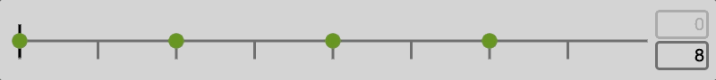

# Polyrhythmic Drum Machine

A drum machine for creating and sharing grooves with unique time feels. [Try it here.](https://adamcogen.github.io/drum-machine/)

For best results, use Chrome browser on Mac. Touchscreens are not yet supported.

[](https://adamcogen.github.io/drum-machine/#eyJsb29wTGVuZ3RoIjoyNDAwLCJyb3dzIjpbIntcInF1YW50aXplZFwiOnRydWUsXCJzdWJkaXZpc2lvbnNcIjoxNixcInJlZmVyZW5jZUxpbmVzXCI6OCxcInJlZmVyZW5jZUxpbmVzU2hpZnRcIjowLFwic3ViZGl2aXNpb25MaW5lc1NoaWZ0XCI6MCxcIm5vdGVzXCI6W3tcInNhbXBsZVwiOlwiaGktaGF0LW9wZW5cIixcImJlYXRcIjowLFwidm9sdW1lXCI6MC4zMTcxODc1MDAwMDAwMDAxLFwibWlkaU5vdGVcIjo0NCxcIm1pZGlWZWxvY2l0eVwiOjE4fSx7XCJzYW1wbGVcIjpcImhpLWhhdC1jbG9zZWRcIixcImJlYXRcIjozLFwidm9sdW1lXCI6MC43NSxcIm1pZGlOb3RlXCI6NDMsXCJtaWRpVmVsb2NpdHlcIjo0Nn0se1wic2FtcGxlXCI6XCJoaS1oYXQtb3BlblwiLFwiYmVhdFwiOjQsXCJ2b2x1bWVcIjowLjMxNzE4NzUwMDAwMDAwMDEsXCJtaWRpTm90ZVwiOjQ0LFwibWlkaVZlbG9jaXR5XCI6MTh9LHtcInNhbXBsZVwiOlwiaGktaGF0LWNsb3NlZFwiLFwiYmVhdFwiOjYsXCJ2b2x1bWVcIjowLjc1LFwibWlkaU5vdGVcIjo0MyxcIm1pZGlWZWxvY2l0eVwiOjQ2fSx7XCJzYW1wbGVcIjpcImhpLWhhdC1vcGVuXCIsXCJiZWF0XCI6OCxcInZvbHVtZVwiOjAuMzE3MTg3NTAwMDAwMDAwMSxcIm1pZGlOb3RlXCI6NDQsXCJtaWRpVmVsb2NpdHlcIjoxOH0se1wic2FtcGxlXCI6XCJoaS1oYXQtY2xvc2VkXCIsXCJiZWF0XCI6OSxcInZvbHVtZVwiOjAuNzUsXCJtaWRpTm90ZVwiOjQzLFwibWlkaVZlbG9jaXR5XCI6NDZ9LHtcInNhbXBsZVwiOlwiaGktaGF0LW9wZW5cIixcImJlYXRcIjoxMixcInZvbHVtZVwiOjAuMzE3MTg3NTAwMDAwMDAwMSxcIm1pZGlOb3RlXCI6NDQsXCJtaWRpVmVsb2NpdHlcIjoxOH1dfSIsIntcInF1YW50aXplZFwiOnRydWUsXCJzdWJkaXZpc2lvbnNcIjo4LFwicmVmZXJlbmNlTGluZXNcIjo0LFwicmVmZXJlbmNlTGluZXNTaGlmdFwiOjAsXCJzdWJkaXZpc2lvbkxpbmVzU2hpZnRcIjozNy43MTQyODU3MTQyODU3MTUsXCJub3Rlc1wiOlt7XCJzYW1wbGVcIjpcImhpLWhhdC1vcGVuXCIsXCJiZWF0XCI6MSxcInZvbHVtZVwiOjAuNTAwMDAwMDAwMDAwMDAwMSxcIm1pZGlOb3RlXCI6NDQsXCJtaWRpVmVsb2NpdHlcIjozMH0se1wic2FtcGxlXCI6XCJoaS1oYXQtb3BlblwiLFwiYmVhdFwiOjMsXCJ2b2x1bWVcIjowLjUwMDAwMDAwMDAwMDAwMDEsXCJtaWRpTm90ZVwiOjQ0LFwibWlkaVZlbG9jaXR5XCI6MzB9LHtcInNhbXBsZVwiOlwiaGktaGF0LW9wZW5cIixcImJlYXRcIjo1LFwidm9sdW1lXCI6MC41MDAwMDAwMDAwMDAwMDAxLFwibWlkaU5vdGVcIjo0NCxcIm1pZGlWZWxvY2l0eVwiOjMwfSx7XCJzYW1wbGVcIjpcImhpLWhhdC1vcGVuXCIsXCJiZWF0XCI6NyxcInZvbHVtZVwiOjAuNTAwMDAwMDAwMDAwMDAwMSxcIm1pZGlOb3RlXCI6NDQsXCJtaWRpVmVsb2NpdHlcIjozMH1dfSIsIntcInF1YW50aXplZFwiOnRydWUsXCJzdWJkaXZpc2lvbnNcIjoxNixcInJlZmVyZW5jZUxpbmVzXCI6NCxcInJlZmVyZW5jZUxpbmVzU2hpZnRcIjowLFwic3ViZGl2aXNpb25MaW5lc1NoaWZ0XCI6NDEuMTQyODU3MTQyODU3MTQ2LFwibm90ZXNcIjpbe1wic2FtcGxlXCI6XCJ3b29kYmxvY2tcIixcImJlYXRcIjoyLFwidm9sdW1lXCI6MC41LFwibWlkaU5vdGVcIjozOSxcIm1pZGlWZWxvY2l0eVwiOjMwfSx7XCJzYW1wbGVcIjpcIndvb2RibG9ja1wiLFwiYmVhdFwiOjYsXCJ2b2x1bWVcIjowLjUsXCJtaWRpTm90ZVwiOjM5LFwibWlkaVZlbG9jaXR5XCI6MzB9LHtcInNhbXBsZVwiOlwid29vZGJsb2NrXCIsXCJiZWF0XCI6MTAsXCJ2b2x1bWVcIjowLjUsXCJtaWRpTm90ZVwiOjM5LFwibWlkaVZlbG9jaXR5XCI6MzB9LHtcInNhbXBsZVwiOlwidG9tXCIsXCJiZWF0XCI6MTQsXCJ2b2x1bWVcIjowLjUsXCJtaWRpTm90ZVwiOjQyLFwibWlkaVZlbG9jaXR5XCI6MzB9LHtcInNhbXBsZVwiOlwidG9tXCIsXCJiZWF0XCI6MTUsXCJ2b2x1bWVcIjowLjUsXCJtaWRpTm90ZVwiOjQyLFwibWlkaVZlbG9jaXR5XCI6MzB9XX0iLCJ7XCJxdWFudGl6ZWRcIjpmYWxzZSxcInN1YmRpdmlzaW9uc1wiOjgsXCJyZWZlcmVuY2VMaW5lc1wiOjQsXCJyZWZlcmVuY2VMaW5lc1NoaWZ0XCI6MCxcInN1YmRpdmlzaW9uTGluZXNTaGlmdFwiOjAsXCJub3Rlc1wiOlt7XCJzYW1wbGVcIjpcImNsYXBcIixcInByaW9yaXR5XCI6NjM0LjI4NTcxNDI4NTcxNDMsXCJ2b2x1bWVcIjowLjUsXCJtaWRpTm90ZVwiOjM4LFwibWlkaVZlbG9jaXR5XCI6MzB9LHtcInNhbXBsZVwiOlwiY2xhcFwiLFwicHJpb3JpdHlcIjoxODY1LjE0Mjg1NzE0Mjg1NyxcInZvbHVtZVwiOjAuNSxcIm1pZGlOb3RlXCI6MzgsXCJtaWRpVmVsb2NpdHlcIjozMH1dfSIsIntcInF1YW50aXplZFwiOnRydWUsXCJzdWJkaXZpc2lvbnNcIjoxNixcInJlZmVyZW5jZUxpbmVzXCI6NCxcInJlZmVyZW5jZUxpbmVzU2hpZnRcIjowLFwic3ViZGl2aXNpb25MaW5lc1NoaWZ0XCI6MCxcIm5vdGVzXCI6W3tcInNhbXBsZVwiOlwiYmFzcy1kcnVtXCIsXCJiZWF0XCI6MCxcInZvbHVtZVwiOjAuOTYzMTI1MDAwMDAwMDAwNyxcIm1pZGlOb3RlXCI6MzYsXCJtaWRpVmVsb2NpdHlcIjo2MH0se1wic2FtcGxlXCI6XCJzbmFyZVwiLFwiYmVhdFwiOjQsXCJ2b2x1bWVcIjowLjUsXCJtaWRpTm90ZVwiOjM3LFwibWlkaVZlbG9jaXR5XCI6MzB9LHtcInNhbXBsZVwiOlwic25hcmVcIixcImJlYXRcIjoxMixcInZvbHVtZVwiOjAuNSxcIm1pZGlOb3RlXCI6MzcsXCJtaWRpVmVsb2NpdHlcIjozMH1dfSIsIntcInF1YW50aXplZFwiOmZhbHNlLFwic3ViZGl2aXNpb25zXCI6MTYsXCJyZWZlcmVuY2VMaW5lc1wiOjQsXCJyZWZlcmVuY2VMaW5lc1NoaWZ0XCI6MCxcInN1YmRpdmlzaW9uTGluZXNTaGlmdFwiOjAsXCJub3Rlc1wiOlt7XCJzYW1wbGVcIjpcImJhc3MtZHJ1bVwiLFwicHJpb3JpdHlcIjo1ODIuODU3MTQyODU3MTQyOSxcInZvbHVtZVwiOjAuOTYzMTI1MDAwMDAwMDAwNyxcIm1pZGlOb3RlXCI6MzYsXCJtaWRpVmVsb2NpdHlcIjo2MH0se1wic2FtcGxlXCI6XCJiYXNzLWRydW1cIixcInByaW9yaXR5XCI6MTE3OS40Mjg1NzE0Mjg1NzE2LFwidm9sdW1lXCI6MC45NjMxMjUwMDAwMDAwMDA3LFwibWlkaU5vdGVcIjozNixcIm1pZGlWZWxvY2l0eVwiOjYwfSx7XCJzYW1wbGVcIjpcImJhc3MtZHJ1bVwiLFwicHJpb3JpdHlcIjoxNjMyLjAwMDAwMDAwMDAwMDIsXCJ2b2x1bWVcIjowLjk2MzEyNTAwMDAwMDAwMDcsXCJtaWRpTm90ZVwiOjM2LFwibWlkaVZlbG9jaXR5XCI6NjB9LHtcInNhbXBsZVwiOlwiYmFzcy1kcnVtXCIsXCJwcmlvcml0eVwiOjE4MzAuODU3MTQyODU3MTQzLFwidm9sdW1lXCI6MC45NjMxMjUwMDAwMDAwMDA3LFwibWlkaU5vdGVcIjozNixcIm1pZGlWZWxvY2l0eVwiOjYwfSx7XCJzYW1wbGVcIjpcImJhc3MtZHJ1bVwiLFwicHJpb3JpdHlcIjoyMTIyLjI4NTcxNDI4NTcxNCxcInZvbHVtZVwiOjAuNTM3NSxcIm1pZGlOb3RlXCI6MzYsXCJtaWRpVmVsb2NpdHlcIjozMn1dfSJdLCJicG0iOjEwMCwibnVtYmVyT2ZCZWF0cyI6NCwiaXNJbkJwbU1vZGUiOnRydWUsInNhbXBsZUxpc3ROYW1lIjoiTG91ZCBLaXQifQ==)

## Overview

This is a drum machine that includes two uncommon key features:

1. No limitation on note divisions
    - Most drum machines only allow us to create rhythms that are divisible into groupings of 2 or 3 (such as 8th notes and triplets).
    - This drum machine allows us to create rhythms using any whole number of divisions, including odd, prime, and large numbers (such as 7th notes, 13ths, 56ths, etc).

2. Shifting rhythmic grid lines
    - Most drum machines only allow us to place notes in two ways: onto an even rhythmic grid that starts at time 0, or anywhere at all (with no grid).
    - This drum machine adds a third option: it lets us shift the rhythmic grid forwards or backwards in time, so that notes uniformly fall "ahead of" or "behind" the beat.

 rhythmic grid lines to create unique swing feels")

Together these features let us create unique rhythms that are difficult (or sometimes impossible) to emulate using most convential sequencers and DAWs.

## High-Level Feature List

- Set each note lane to have any whole number of beats (rhythmic grid lines). This allows us to create complex polyrhythms, odd time signatures, and unusual note divisions.
- Shift each note lane's rhythmic grid lines forwards or backwards in time, so that notes fall ahead of or behind the beat while remaining evenly spaced. Or, remove rhythmic grid lines entirely. This allows us to experiment with and fine-tune the time feel of our grooves.
- Share grooves by copying and pasting the browser URL, which automatically updates any time we make changes.
- Use the browser's 'back' and 'forward' buttons to undo and redo changes.
- All interactive GUI elements show help text on mouse-over. It appears in the gray bar at the bottom of the window.
- Choose from several built-in drum kits for live audio output.
- Output live MIDI to any DAW or MIDI device, or export sequencer patterns to MIDI files.
- Specify tempo as BPM (beats per minute), or as a loop length in milliseconds
  - BPM input mode includes a 'tap tempo' button
  - Millisecond loop length can be useful for making rhythmic transcriptions from an existing sound file
- Load example sequencer patterns from the 'examples' dropdown.
- Adjust the volume of each note using cntrl+click. The louder the note, the larger its circle will be on-screen.

## How To Run Locally

Running the drum machine locally allows you to use your own custom drum kits, change default MIDI output pitches and velocities, update the configuration of the GUI, or make other code changes.

- A local HTTP server may be needed for some browsers, to avoid Cross Origin Request issues when loading assets.

  - **For Mac**, run one of the .sh files included in this repo from the Terminal to start the HTTP server:

    - If you have Python 2 installed, run `sh server.python2.sh`. 

    - Or, if you have Python 3 installed, run `sh server.python3.sh`.

  - **For Windows**, you can't run .sh files, but you should just be able to run the commands that are contained in the .sh files from the Command Line to start the HTTP server.

- Then in a browser go to `http://localhost:8000/`, and replace 8000 with whatever port number the server says it's running on.

You may need to clear your browser's cache in order for local changes to be applied.

## Project Structure

* `index.html` main HTML webpage
* `code/` contains all JavaScript source code
  * `drum-machine.js` main source code file from which the drum machine is instantiated
  * `priority-linked-list.js` implementation of a custom linked list data structure, to be used as the backend datastore for each note lane. Unit tests are included here.
  * `sequencer.js` implementation of the sequencer, including the note scheduling algorithm and logic for reconfiguring sequencer patterns.
  * `gui.js` implementation of the GUI, including buttons, event listeners, etc.
  * `audio-drivers.js` interface and implementations for different audio drivers (WebAudio and MIDI) to standardize how the sequencer interacts with different audio output libraries.
  * `gui-configurations.js` definitions of constants used to define GUI display and behavior, formatted as a JSON object for convenience.
  * `lib/` contains all third-party libraries used in the project.
* `assets/` contains icons, sound files, and any other assets used by the drum machine.

## Acknowledgements

 - The colorful and interactive user interface was inspired by the amazing [Cync](https://github.com/tiburzi/cync) drum machine.
 - The scheduling of audio ahead-of-time using the WebAudio API was informed by projects and articles from Chris Wilson, including [MIDIDrums](https://github.com/cwilso/MIDIDrums), [Web Audio Metronome](https://github.com/cwilso/metronome), and especially the article [A Tale Of Two Clocks](https://www.html5rocks.com/en/tutorials/audio/scheduling/).
 - Many thanks to Jon for user testing, and helping brainstorm solutions to tough GUI design problems.
 - For an early Python prototype of this drum machine, see my old repo [Drum Machine Proof Of Concept](https://github.com/adamcogen/drum-machine-py-poc).